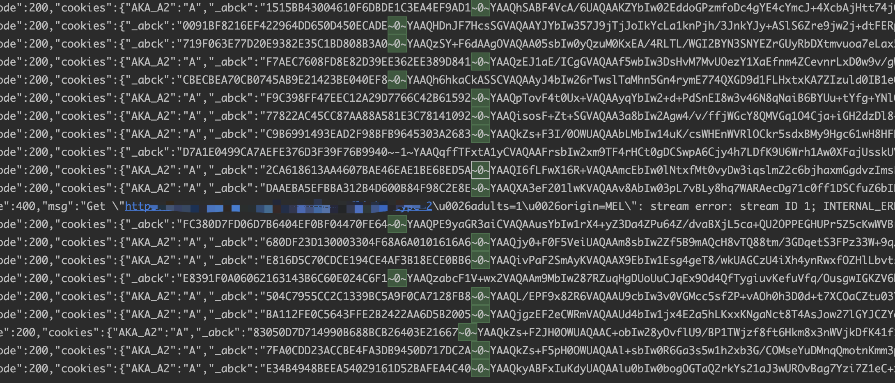

# akamai3.0-reverse
I made a script for generating the Akamai sensor_data, used in retrieving the '_abck' cookie. Language: Golang.

Contact: 
- Telegram: @deliberatela

this is work for jq(www.jetstar.com)
